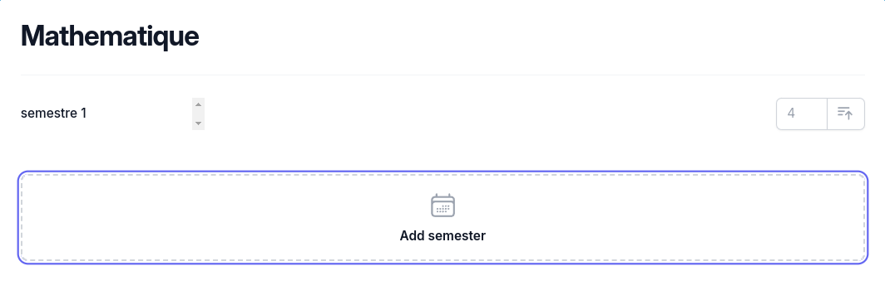

# React <Badge type="tip" text="JS" />

I got the occasion to use React on the [grade calculator](../../projects/grades-calculator.md).

## How did I do it

To help me with that, the [React documentation](https://react.dev/learn) really helped me.

### Here is an exemple of my code


```jsx
// Function to render SemesterRow components based on the semesters array
const renderSemesterRows = () => {
    // Map through the semesters array to create SemesterRow components
    return semesters.map((_average, index) => (
        // Each SemesterRow is associated with a unique key and a semester number
        <SemesterRow
            // Callback function to handle the addition of a new average for the current semester
            onNewAverageAdded={(g) => newAverage(index, g)}
            key={index} // Unique key for React to efficiently identify each SemesterRow0
            semesterNumber={index + 1} // Semester number is one-based, so index + 1
        />
    ));
}

```

This code create a new semester each time you click on the button "add semester" 



## [Go to project](../../projects/grades-calculator.md)