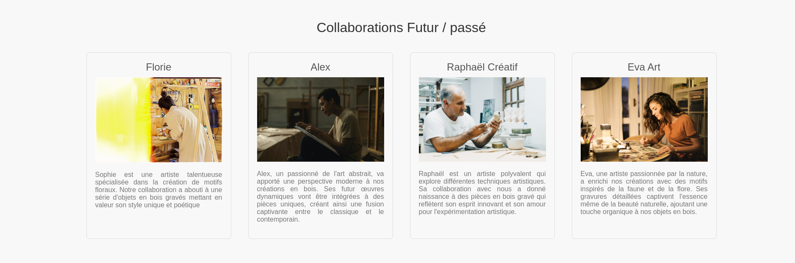

# Blakiti Website  <Badge type="tip" text="Html css"/>

## What is the project purpose ?
The purpose of this project was to learn how to use HTML and CSS to create a website, to have a basic knowledge of how to create a website from scratch.

## How it looks like
This is the page where I show what the products look like, it is only the product. If you want to see the product in detail, you can scroll down to the mock-up.


Here, I created a "collaboration" page, where I show all the collaboration I did with artist.


## How did I do it

first, I needed to make a mock-up, which I did on [figma](https://www.figma.com/file/gEXFCc3bPYPzL4NK860PjI/Untitled?type=design&node-id=0%3A1&mode=design&t=qXVjhaH8kzigYXW2-1) (link show the figma mock-up if you want to see details)


Then, All I needed was to use Html and css to make it. <br><br>
This is how the collaborator part looks like in Html :

```html
    <!-- We put all that in a <div> -->
    <div class="artist-card">
        <!-- Here we give the artist name -->
      <div class="artist-name">Florie</div>
      <picture class="artistPhoto">
          <!-- Here we give the picture of the artist -->
        
      </picture>
    
        <!-- And this is the description of the artist -->
      <p class="artist-description">
        Sophie est une artiste talentueuse spécialisée dans la création de
        motifs floraux. Notre collaboration a abouti à une série d'objets en
        bois gravés mettant en valeur son style unique et poétique
      </p>
    </div>
```

Here is his css which give him his style :

```css
/* Styling for the collaboration section */
.collaboration-section {
    background-color: #f8f8f8;
    padding: 50px;
    text-align: center;
}

/* Styling for the title of the collaboration section */
.collaboration-title {
    font-size: 2em;
    color: #333;
    margin-bottom: 20px;
}

/* Styling for the container of individual artist items */
.collaboration-item {
    display: flex;
    flex-wrap: wrap;
    justify-content: center;
}

/* Styling for each artist card */
.artist-card {
    margin: 20px;
    padding: 20px;
    border: 1px solid #ddd;
    border-radius: 8px;
    max-width: 300px;
}

/* Styling for the artist's name */
.artist-name {
    font-size: 1.5em;
    color: #555;
    margin-bottom: 10px;
}

/* Styling for the artist's description */
.artist-description {
    color: #777;
    text-align: justify;
}

/* Styling for the artist's photo */
.artist-photo {
    width: 300px;
}

```

All this is connected by a link in the index.html file :
```html
<!-- In the <head> of the html -->
<link href="./css/menu.css" rel="stylesheet" >
```

## You can find the [GitHub depot here](https://github.com/Alex-zReeZ/Blakiti-Website)

