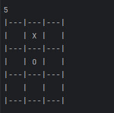

# Java TicTacToe <Badge type="tip" text="Java" />

## What is the project purpose ?

This project was made to use the Java knowledge that we acquire by doing the exercises proposed by Intellj.

## How it looks like

### Game Begin


### First player :


### Second Player :



### Winner


## How did I do it

```Java

static String checkWinner() { // Check the combination to win the game
    // Define an array of winning combinations in a Tic-Tac-Toe game
    String[] win_combinations = {"123", "147", "159", "258", "357", "369", "456", "789"};

    // Iterate through each winning combination
    for (String line : win_combinations) {
        // Extract the characters at the positions specified in the winning combination from the 'board' array
        String sequence = "" + board[line.charAt(0) - '1'] + board[line.charAt(1) - '1'] + board[line.charAt(2) - '1'];

        // Check if the sequence in the current winning combination equals "XXX"
        if (sequence.equals("XXX")) {
            return "X"; // If true, player X wins
        }
        // Check if the sequence in the current winning combination equals "OOO"
        if (sequence.equals("OOO")) {
            return "O"; // If true, player O wins
        }
    }

    // Check if all elements in the 'board' array are either "X" or "O", indicating a draw
    if (Arrays.stream(board).allMatch(s -> s.equals("X") || s.equals("O"))) return "draw";

    // If none of the winning combinations are satisfied and the game is not a draw, return null
    return null;
}

```

This is a very simple Java file, don't need to install anything. \
and how to develop !

## You can find the [GitHub depot here](https://github.com/Alex-zReeZ/TicTacToe)
