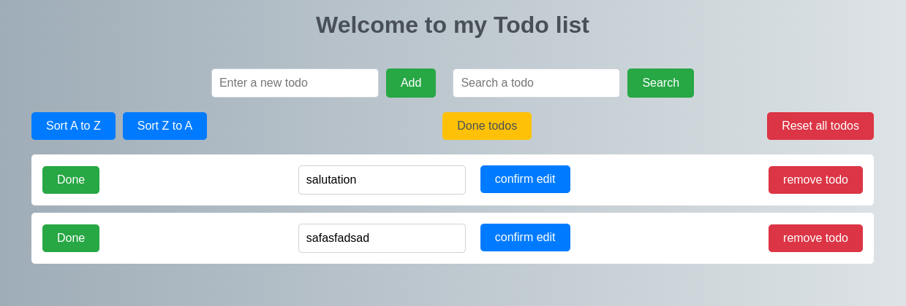

# Slim todolist <Badge type="tip" text="PHP" />

## What is the project purpose ?

The purpose of this project was to use a PHP framework to learn how to make roots

## How it looks like



## How did I do it

For that project, I used [Slim](../languages/framework/Slim.md) framework.

### Here is an exemple of my code


```php

// Add a new todo
$app->post('/todo/add', function ($request, $response) {
    global $pdo;

    // Get the todo name from the parsed request body
    $todoName = $request->getParsedBody()['todo'];

    // Check if the length of the todo name is between 3 and 50 characters
    if (strlen($todoName) >= 3 && strlen($todoName) <= 50) {
        // Prepare and execute an SQLite query to insert the todo into the database
        $stmt = $pdo->prepare("INSERT INTO todo (name) VALUES (:name)");
        $stmt->bindParam(':name', $todoName);
        $stmt->execute();

        // Set a success message in the session
        $_SESSION['Messages'] = ["The todo has been added"];
    } else {
        // Set an error message in the session if the input length is not within the specified range
        $_SESSION['Messages'] = ["Error: Input length should be between 3 and 50 characters."];
    }

    // Redirect the user to the '/todo' page after adding the todo
    return $response->withHeader('Location', '/todo')->withStatus(302);
});

```

In this code, I take a todo that was written in the [Entrer a new todo](#how-it-looks-like) input, check the input todo length, write it into
the database if the length is good and finally writing a success message or an error message.

For the database, we used the SQLite database.

## How to initiate project

```shell

#First you need PHP

# Then you are gonna need Composer
php -r "copy('https://getcomposer.org/installer', 'composer-setup.php');"
php -r "if (hash_file('sha384', 'composer-setup.php') === 'edb40769019ccf227279e3bdd1f5b2e9950eb000c3233ee85148944e555d97be3ea4f40c3c2fe73b22f875385f6a5155') { echo 'Installer verified'; } else { echo 'Installer corrupt'; unlink('composer-setup.php'); } echo PHP_EOL;"
php composer-setup.php
php -r "unlink('composer-setup.php');"

# After that, you are gonna install Slim with "require"
composer require slim/slim:"4.*"

# With slim, you will need the PSR-7 
composer require slim/psr7


```

If something doesn't work, check [Slim](https://www.slimframework.com/docs/v4/start/installation.html) documentation 

## You can find the [GitHub depot here](https://github.com/Alex-zReeZ/todolist-slim-twig)
