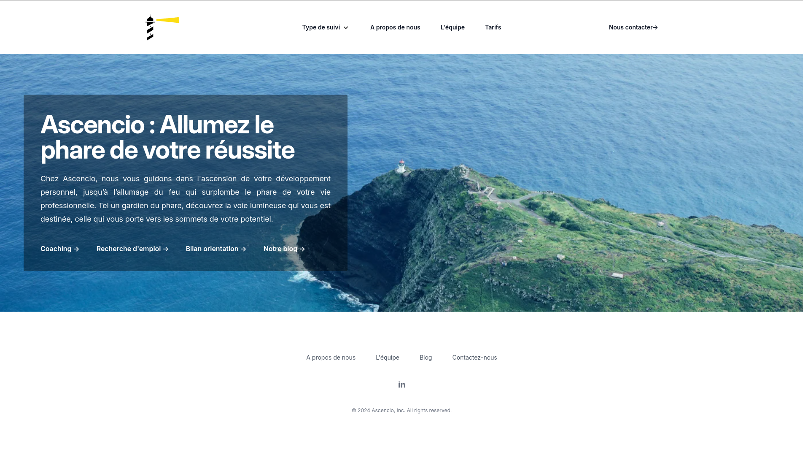

# Ascencio <Badge type="tip" text="Js" />

## What is the project purpose ?

The purpose of this project was to create the website for the product of the company Jobtrek named Ascencio.
The website is a showcase of the product and the company.

## How it looks like

This is a screenshot from the home page

## How did I do it

To do that website, I used Astro, a Javascript framework that allows you to create static website with dynamic content.

## You can find the website [here](https://ascencio.ch)

This is a private repository, so you can't see the code, but you can go see the website on the link above.
