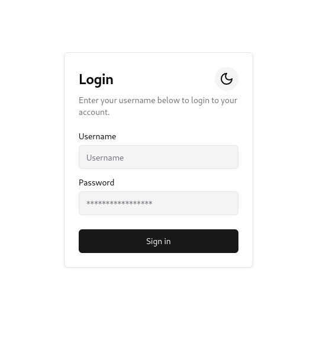
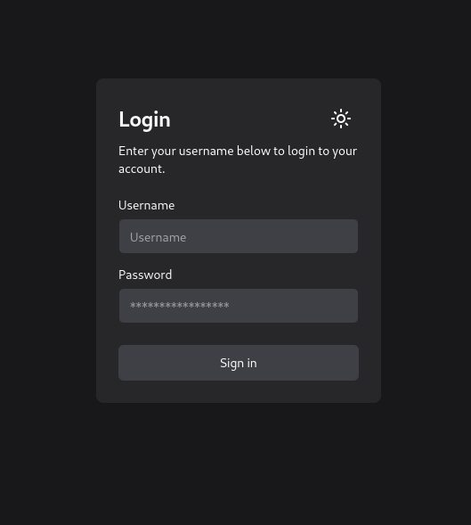
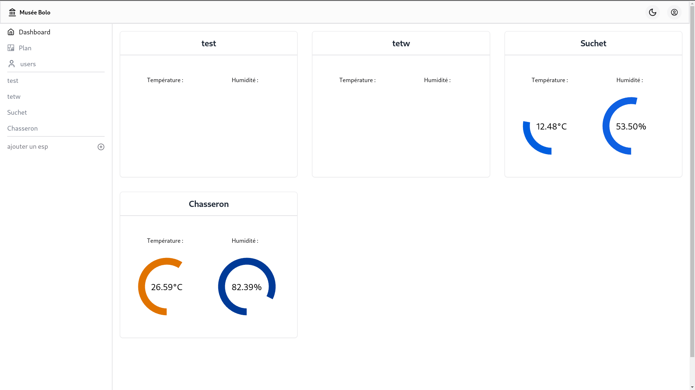
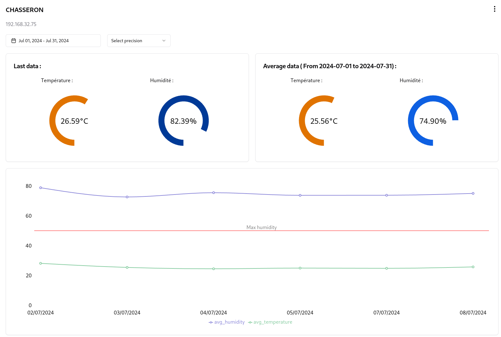

# Climate Guardian <Badge type="tip" text="JS"/>

## What is the project purpose ?

This project was made for the non-profit organization named memoires-informatiques.
Memoires-informatiques has a lot of old computers and other electronic devices that need to be stored in a controlled environment
The goal of this project is to monitor the temperature and humidity of the different rooms of the organization and to display the data on a web interface
So this project is more of an interface, which you can't find on the internet.

## How it looks like

### Login Page :

This is the web interface of the login page, with a dark mode implemented in all the website.

For a question of visibility, we will only show the dark mode of the login page.

|  |  |
| :-----------------------------------------------------------------------------: | :-----------------------------------------------------------------------------: |
|                                Login Page white                                 |                                Login Page black                                 |

### The dashboard :

Then we arrive on the dashboard, where we can see the temperature and humidity of the different rooms.



You can also see the dashboard on the left, here are some element of it.

- Dashboard to see the actual temperature and humidity of the different rooms
- A plan to see where the different rooms and Esp are located
- A user page, to add and delete users
- A room page, where there are a lot more information about the room

### The room page :

Here is the room page, where you can see the different information about the room.



And under that, there is the plan with where only this room is located.

## Here is an exemple of my code

```tsx
// Function to get the data from the API
export const useFetchData = (
  precision: string,
  ip: string,
  from: string,
  to: string,
) => {
  const [data, setData] = useState<avgData[]>([]);

  useEffect(() => {
    const url = `/postgrest/rpc/avg_date?delta=${precision}&ip=eq.${ip}&and=(date.gte.${from},date.lt.${to})`;
    fetchWithAuth(url);
    fetch(url, { headers: { Authorization: `Bearer ${getToken()}` } })
      .then((response) => response.json())
      .then((apiData: avgData[]) => {
        setData(apiData);
      })
      .catch((e) => {
        console.error("Une erreur s'est produite :", e);
      });
  }, [from, ip, precision, to]);
  return data;
};
```

The useFetchData function is designed to retrieve data from an API based on specific parameters: precision, IP address, and date range. This function uses React hooks to manage the data fetching process and state management.

## You can find the [GitHub depot here](https://github.com/museebolo/climat_guardian)
