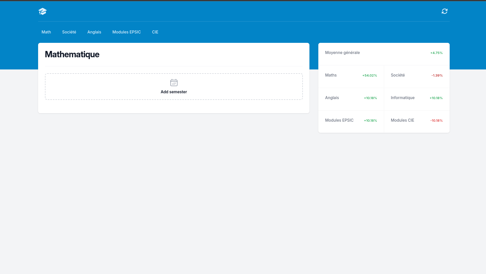
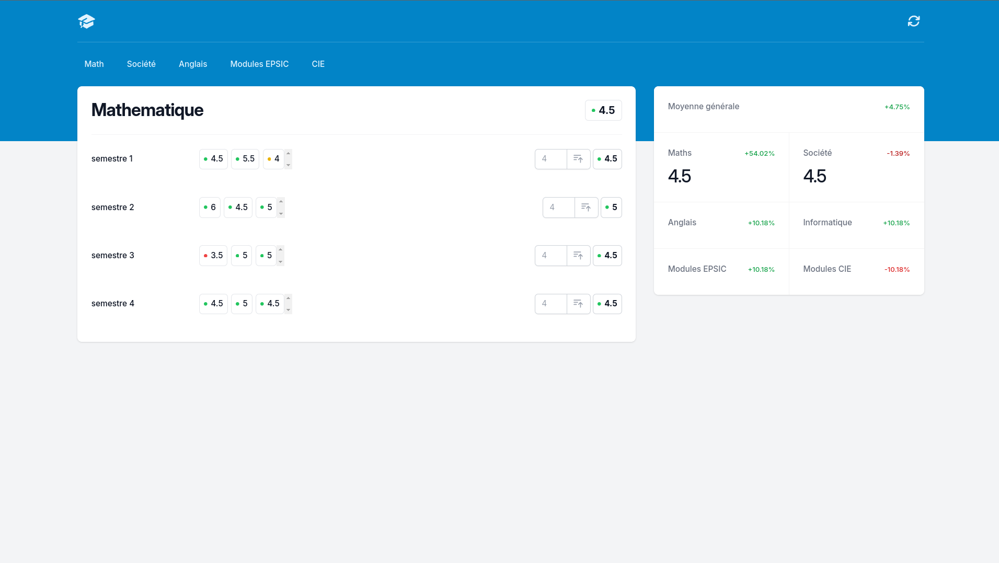
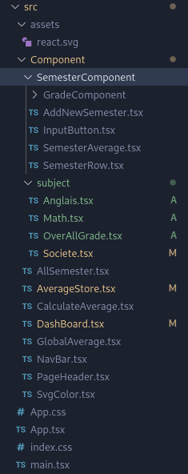

# JavaScript grade calculator  <Badge type="tip" text="JS" />

## what is the project purpose ?

The purpose of this website is to calculate a student's grades, determining all the necessary averages.
It serves as a tool to help the student keep track of their grades during their learning.

## How it look like 

### Without grades added :



###  With grades added :




## How did I do it

This project is made with the framework called [React.js](https://react.dev) used with 
[TypeScript](https://www.typescriptlang.org/docs/handbook/typescript-in-5-minutes.html). For the aspect of the website,
I used a framework called [Tailwind.css](https://tailwindcss.com/)
\
\
And to connect all that,
we need to use [Vitejs](https://vitejs.dev/guide/), which propose file template for your project with different framework. 
In this case, we're going to use the React-ts template. Which will give us this :


```shell
# Project creation
npm create vite@latest  grades-view-react -- --template react-ts

# Install dependencies needed for the project
npm i

# Install Tailwind.css 
npm install -D tailwindcss

```
For configuring Tailwind.css in your files, follow [these instructions](https://tailwindcss.com/docs/installation)

Then, you can start working on your project, separating your html code in different component which look like that for me :



## [You can find the GitHub depot here](https://github.com/Alex-zReeZ/grades-calculator-react)

