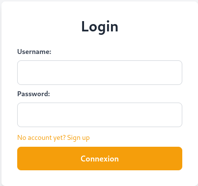
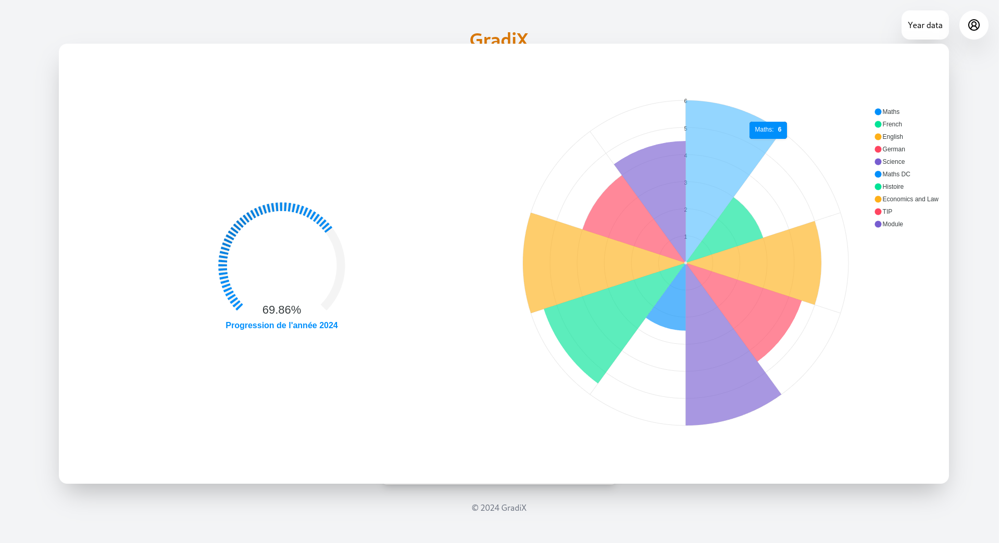
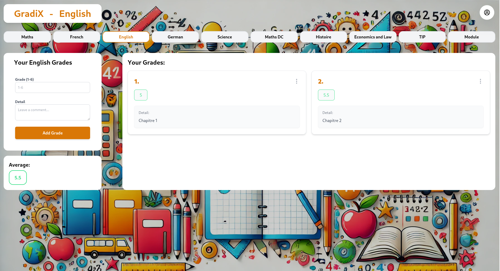

# GradiX <Badge type="tip" text="JS"/>

## What is the project purpose ?

This project was made for myself to calculate my grade for my school.
I wanted to have a better visualization of my grade and to know how much I need to have to pass my year.

To do that, I used the Django rest framework for the backend and React for the frontend app.

## How it looks like

### Login Page :

This is the web interface of the login page



### The dashboard :

Then we arrive on the dashboard, where we can see the different subjects and the grade we have in it.
We can also see the average of all the subjects when clicking on the "Year data" button.




### The subject page :

Here is the subject page, where you can see the different information about the subject. You can see all your grades, 
add and delete grades, and see the average of your grades.



## Here is an exemple of my code

```python
    # Here is an example of the UserViewSet in the views.py file, which is use to login and signup new user to the app
   
    class UserViewSet(viewsets.ModelViewSet):
        queryset = User.objects.all()
        serializer_class = UserSerializer
        permission_classes = [IsOwner]
        
        def get_queryset(self):
        return self.queryset.filter(id=self.request.user.id)
        
        # This action is used to login a user to the app by checking if the user exists and if the password is correct
        @action(detail=False, methods=['post'])
        def login(self, request):
        user = get_object_or_404(User, username=request.data['username'])
        if not user.check_password(request.data['password']):
        return Response({"detail": "Not found."}, status=status.HTTP_404_NOT_FOUND)
        token, created = Token.objects.get_or_create(user=user)
        serializer = UserSerializer(instance=user)
        return Response({"token": token.key, "user": serializer.data})
        
        # This action is used to signup a new user to the app by saving it to the database
        @action(detail=False, methods=['post'])
        def signup(self, request):
        serializer = UserSerializer(data=request.data)
        if serializer.is_valid():
        serializer.save()
        user = User.objects.get(username=request.data['username'])
        user.set_password(request.data['password'])
        user.save()
        token = Token.objects.create(user=user)
        return Response({"token": token.key, "user": serializer.data})
        return Response(serializer.errors, status=status.HTTP_400_BAD_REQUEST)

```

## You can find the [GitHub depot here](https://github.com/Alex-zReeZ/Grade_calculator_djangoReact)
