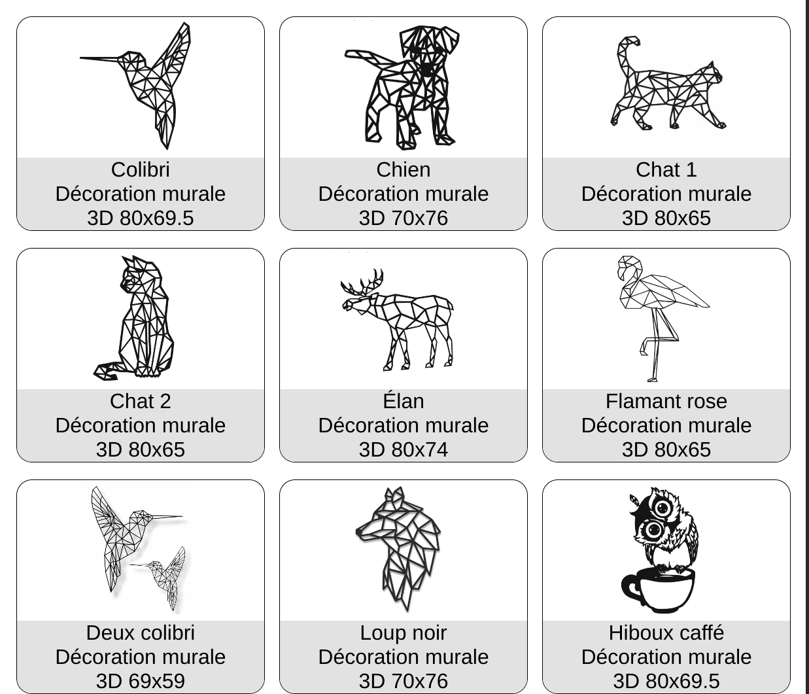
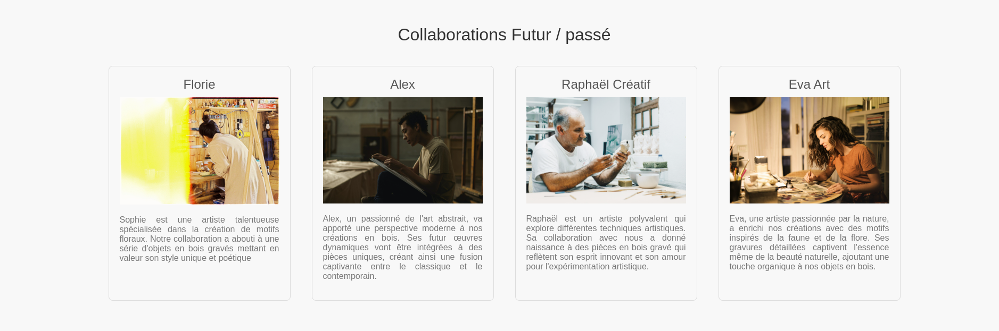
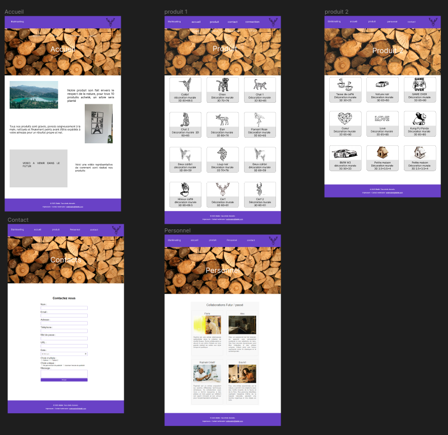

# Blakiti Website <Badge type="tip" text="Html css"/>

## Purpose

Blakiti is a fictional brand of engraved wooden objects, used as the subject of a training exercise
on building a website from scratch. The site presents the products and shows the artists the brand
collaborates with, all of them invented for the exercise. I did the whole project, from the mock-up
to the finished pages.

## Technologies

- HTML
- CSS
- Figma

## How it works

I started with a mock-up in [Figma](https://www.figma.com/file/gEXFCc3bPYPzL4NK860PjI/Untitled?type=design&node-id=0%3A1&mode=design&t=qXVjhaH8kzigYXW2-1),
covering every page before writing any code, then reproduced it in plain HTML and CSS. Each page
links its stylesheets from its head, and the recurring blocks (a product, an artist card) are built
as a repeated structure styled by a single class.

## Screens

The products page:



The collaboration page:



The mock-up the pages were built from:



Here is the markup of one artist card:

```html
<!-- We put all that in a <div> -->
<div class="artist-card">
  <!-- Here we give the artist name -->
  <div class="artist-name">Florie</div>
  <picture class="artistPhoto">
    <!-- Here we give the picture of the artist -->
    
  </picture>

  <!-- And this is the description of the artist -->
  <p class="artist-description">
    Sophie est une artiste talentueuse spécialisée dans la création de motifs
    floraux. Notre collaboration a abouti à une série d'objets en bois gravés
    mettant en valeur son style unique et poétique
  </p>
</div>
```

And the CSS that gives the section its layout, the cards flowing on several rows when the screen
gets narrower:

```css
/* Styling for the container of individual artist items */
.collaboration-item {
  display: flex;
  flex-wrap: wrap;
  justify-content: center;
}

/* Styling for each artist card */
.artist-card {
  margin: 20px;
  padding: 20px;
  border: 1px solid #ddd;
  border-radius: 8px;
  max-width: 300px;
}

/* Styling for the artist's name */
.artist-name {
  font-size: 1.5em;
  color: #555;
  margin-bottom: 10px;
}
```

## Operational Competencies Acquired

I designed the interface as a mock-up first, checked that what I had drawn could actually be built
with the techniques I had, then developed it into working pages, including the behaviour of the
cards when the available width changes. **(g2)**

**Operational competencies:** g2

## Source code

The repository is available [here](https://github.com/Alex-zReeZ/Blakiti-Website).
