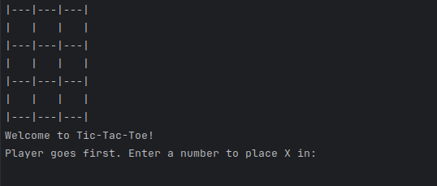
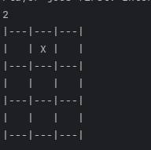
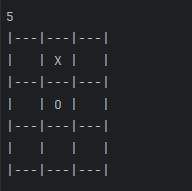
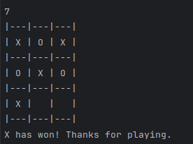

# Java TicTacToe <Badge type="tip" text="Java" />

## Purpose

This is a tic tac toe played by two people in the command line, written to put into practice the
Java notions covered by the IntelliJ exercises. I wrote the whole program.

## Technologies

- Java

## How it works

The board is an array of nine cells. The winning positions are written once as a list of three digit
combinations, and after each move the program rebuilds the sequence of symbols sitting at those three
positions and compares it with a full row of X or of O. If no combination matches and no cell is
left empty, the game is a draw.

```Java

static String checkWinner() { // Check the combination to win the game
    // Define an array of winning combinations in a Tic-Tac-Toe game
    String[] win_combinations = {"123", "147", "159", "258", "357", "369", "456", "789"};

    // Iterate through each winning combination
    for (String line : win_combinations) {
        // Extract the characters at the positions specified in the winning combination from the 'board' array
        String sequence = "" + board[line.charAt(0) - '1'] + board[line.charAt(1) - '1'] + board[line.charAt(2) - '1'];

        // Check if the sequence in the current winning combination equals "XXX"
        if (sequence.equals("XXX")) {
            return "X"; // If true, player X wins
        }
        // Check if the sequence in the current winning combination equals "OOO"
        if (sequence.equals("OOO")) {
            return "O"; // If true, player O wins
        }
    }

    // Check if all elements in the 'board' array are either "X" or "O", indicating a draw
    if (Arrays.stream(board).allMatch(s -> s.equals("X") || s.equals("O"))) return "draw";

    // If none of the winning combinations are satisfied and the game is not a draw, return null
    return null;
}

```

## Screens

The board as it is printed when the game starts:



The two players take their turn, X first:

|  |  |
| :--------------------------------------------------------------------------: | :---------------------------------------------------------------------------: |
|                             The first player plays                            |                            The second player plays                            |

And the end of the game:



## Operational Competencies Acquired

I implemented the program in Java, including the game loop, the reading of the players' moves and
the detection of a win or a draw. **(g5)**

**Operational competencies:** g5

## Source code

The repository is available [here](https://github.com/Alex-zReeZ/TicTacToe).
