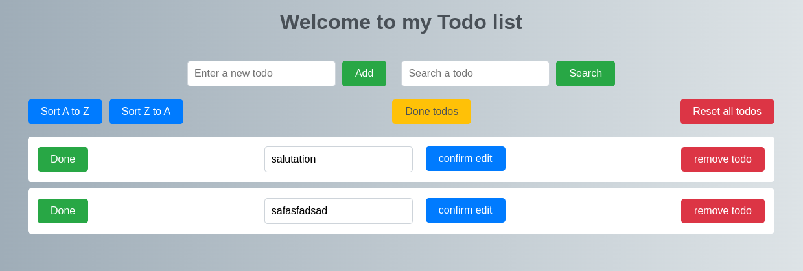

# Slim todolist <Badge type="tip" text="PHP" />

## Purpose

The same todo list, this time built on a PHP framework in order to learn how routing is handled by
one. Slim maps the URLs to the code, Twig renders the pages and SQLite stores the tasks. I built it
alone.

## Technologies

- PHP
- Slim 4
- Twig
- SQLite
- Composer

## How it works

Each route is declared with its HTTP method and its path, and receives the request and the response
as arguments. Adding a task goes through a POST route that reads the submitted title, refuses it
unless its length falls between 3 and 50 characters, inserts it with a prepared statement, puts a
success or an error message in the session, and redirects back to the list so a refresh does not
resubmit the form.

```php

// Add a new todo
$app->post('/todo/add', function ($request, $response) {
    global $pdo;

    // Get the todo name from the parsed request body
    $todoName = $request->getParsedBody()['todo'];

    // Check if the length of the todo name is between 3 and 50 characters
    if (strlen($todoName) >= 3 && strlen($todoName) <= 50) {
        // Prepare and execute an SQLite query to insert the todo into the database
        $stmt = $pdo->prepare("INSERT INTO todo (name) VALUES (:name)");
        $stmt->bindParam(':name', $todoName);
        $stmt->execute();

        // Set a success message in the session
        $_SESSION['Messages'] = ["The todo has been added"];
    } else {
        // Set an error message in the session if the input length is not within the specified range
        $_SESSION['Messages'] = ["Error: Input length should be between 3 and 50 characters."];
    }

    // Redirect the user to the '/todo' page after adding the todo
    return $response->withHeader('Location', '/todo')->withStatus(302);
});

```

## Screens



## Operational Competencies Acquired

I implemented the application on top of Slim: the routes, the Twig templates, the persistence in
SQLite, and the validation of what the user submits before it reaches the database.

## Source code

The repository is available [here](https://github.com/Alex-zReeZ/todolist-slim-twig).
