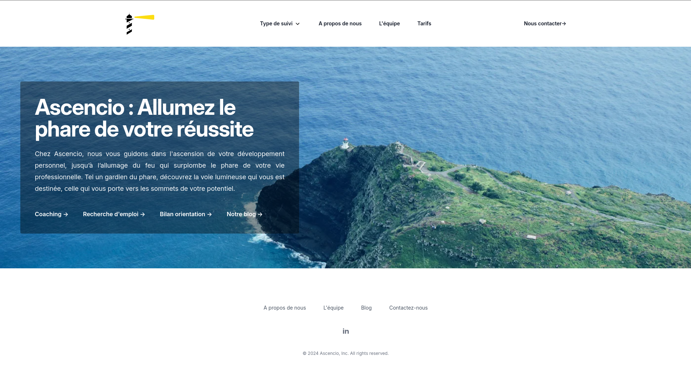

# Ascencio <Badge type="tip" text="Js" />

## Purpose

Ascencio is a product built by Jobtrek. This project is the public website that presents it, acting
both as a showcase for the product and as a presentation of the company behind it. I built the site.

## Technologies

- Astro

## How it works

Astro renders the pages ahead of time and serves them as static HTML, while still allowing the
content of those pages to be generated from data rather than written by hand in each file.

## Screens

## Operational Competencies Acquired

I implemented the front-end of the site with Astro, building the pages that present the product and
the company.

## Live site

You can find the site [here](https://ascencio.ch). The repository is private, so the code itself is
not publicly available.
