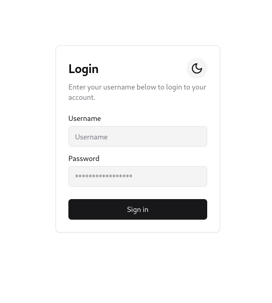
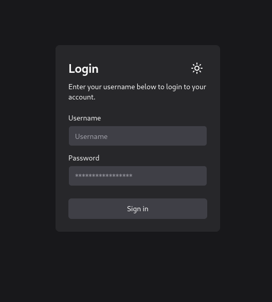
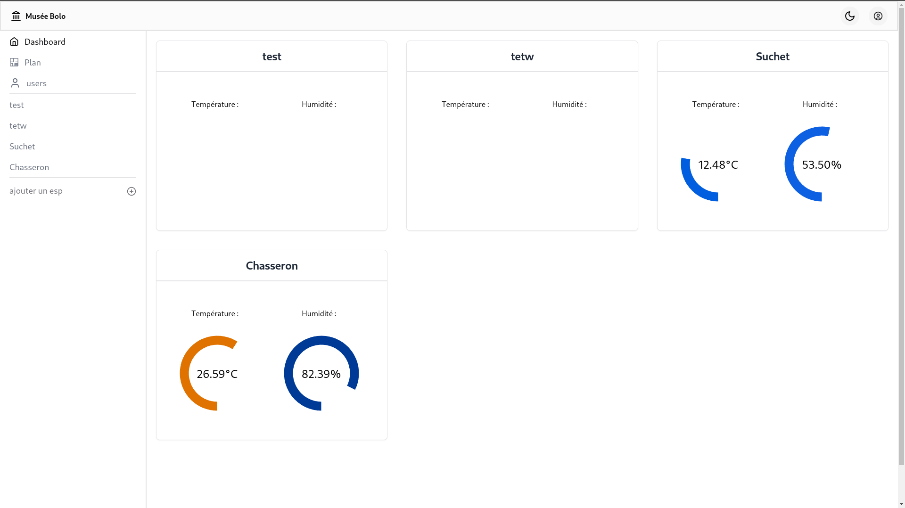
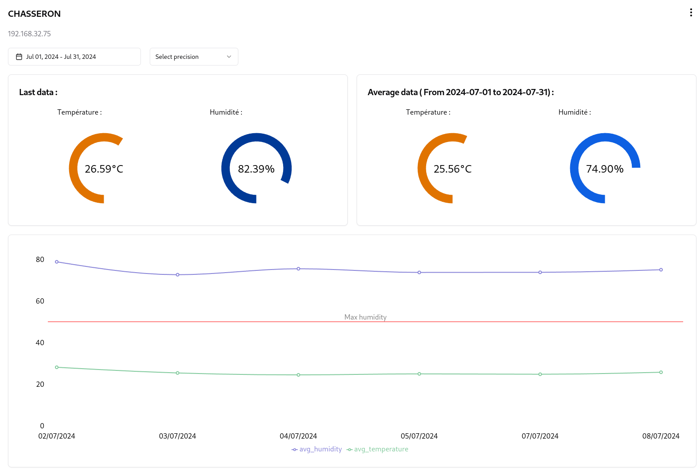

# Climate Guardian <Badge type="tip" text="JS"/>

## Purpose

Climate Guardian was built for the non-profit organisation Memoires Informatiques, which keeps a
large collection of old computers and electronic devices that has to be stored in a controlled
environment. The application monitors the temperature and the humidity of the organisation's rooms
and presents the readings on a web interface, so a room drifting out of range becomes visible. The
interface is the part of the system I worked on.

> TODO: state which parts of the project were yours and which were done by the rest of the team.

## Technologies

- React
- TypeScript
- PostgREST
- ESP sensors

## How it works

The sensors placed in the rooms feed their readings into the database. PostgREST exposes that
database directly as an HTTP API, including stored procedures, so the front-end asks for what it
needs through a single call: the average readings for one sensor, over a chosen period, at a chosen
level of precision. Every request carries a bearer token, and the pages behind the login are the
dashboard with the live values, a floor plan locating the rooms and their sensors, a page per room
with its detailed history, and a user administration page. The whole interface has a light and a
dark theme.

## Screens

|  |  |
| :-------------------------------------------------------------------------------: | :--------------------------------------------------------------------------------: |
|                                  Login, light theme                                |                                  Login, dark theme                                 |

The dashboard:



A room, with its readings and its position on the plan:



The hook that fetches the averaged readings, parameterised by precision, sensor and date range:

```tsx
// Function to get the data from the API
export const useFetchData = (
  precision: string,
  ip: string,
  from: string,
  to: string,
) => {
  const [data, setData] = useState<avgData[]>([]);

  useEffect(() => {
    const url = `/postgrest/rpc/avg_date?delta=${precision}&ip=eq.${ip}&and=(date.gte.${from},date.lt.${to})`;
    fetchWithAuth(url);
    fetch(url, { headers: { Authorization: `Bearer ${getToken()}` } })
      .then((response) => response.json())
      .then((apiData: avgData[]) => {
        setData(apiData);
      })
      .catch((e) => {
        console.error("Une erreur s'est produite :", e);
      });
  }, [from, ip, precision, to]);
  return data;
};
```

## Operational Competencies Acquired

I implemented the front-end in React and TypeScript, including the calls to the API, the
authenticated requests and the pages that make up the interface. **(g5)**

I worked on the reading side of the measurements: querying them from storage, aggregating them by
period through the API, and presenting them in a form where an anomaly in a room can be spotted
rather than read off a raw table. **(c4)**

**Operational competencies:** g5, c4

## Source code

The repository is available [here](https://github.com/museebolo/climat_guardian).
