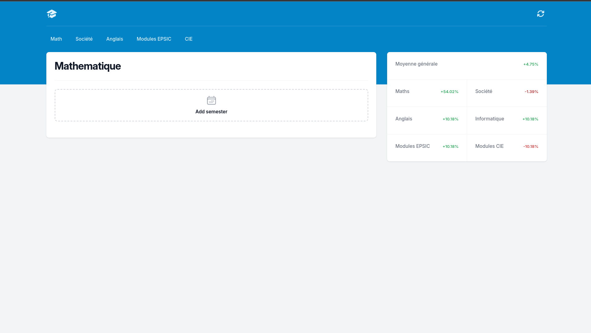
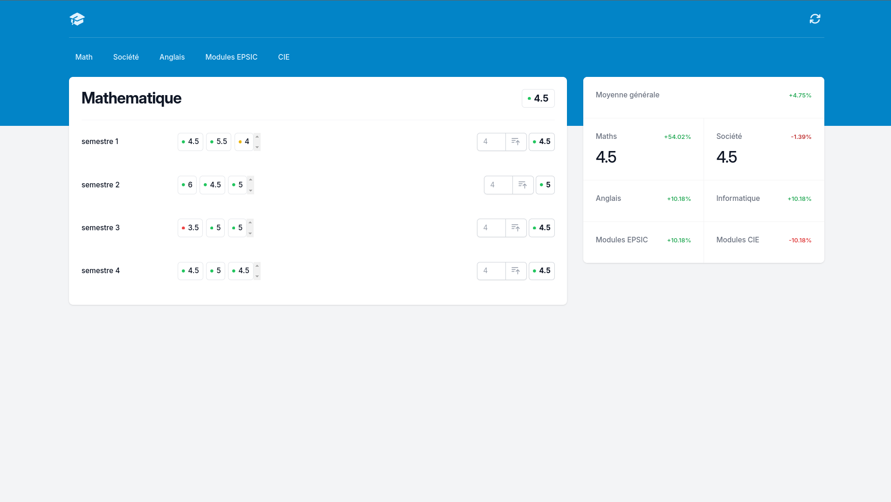
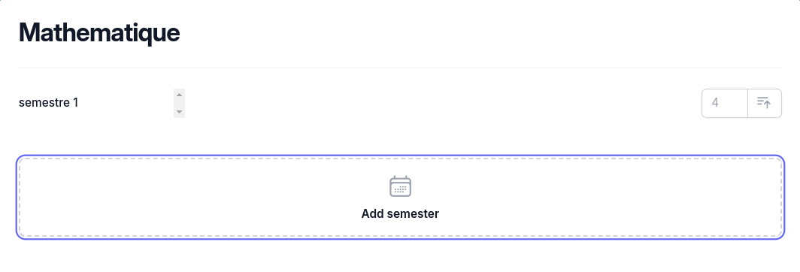
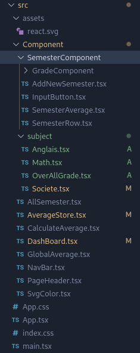

# JavaScript grade calculator <Badge type="tip" text="JS"/>

## Purpose

This web application computes a student's grades and the averages that derive from them, so the
student can follow where they stand during their training instead of recomputing everything by hand.
I built it entirely, and it runs in the browser with no back-end behind it.

## Technologies

- React
- TypeScript
- Tailwind CSS
- Vite

## How it works

The interface is split into components: a semester row holds the grades entered for one semester and
reports its average upwards, and the page keeps the list of semesters. Adding a semester appends an
entry to that list, which React renders as one more row, so the number of semesters is data rather
than markup.

```tsx
// Function to render SemesterRow components based on the semesters array
const renderSemesterRows = () => {
  // Map through the semesters array to create SemesterRow components
  return semesters.map((_average, index) => (
    // Each SemesterRow is associated with a unique key and a semester number
    <SemesterRow
      // Callback function to handle the addition of a new average for the current semester
      onNewAverageAdded={(g) => newAverage(index, g)}
      key={index} // Unique key for React to efficiently identify each SemesterRow0
      semesterNumber={index + 1} // Semester number is one-based, so index + 1
    />
  ));
};
```

## Screens

Before any grade is entered:



And with grades entered:



The button that adds a semester:



How the components are split:



## Operational Competencies Acquired

I implemented the application in React and TypeScript, from the component structure down to the
computation of the averages and the state that ties the rows to the page. **(g5)**

**Operational competencies:** g5
