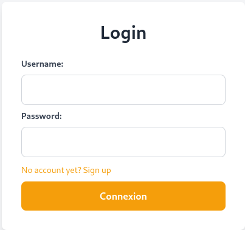
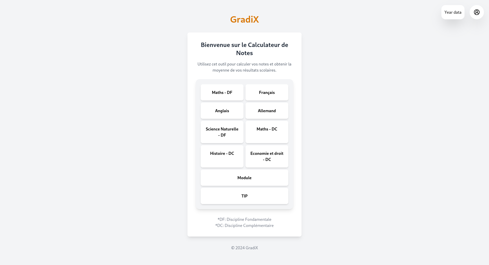
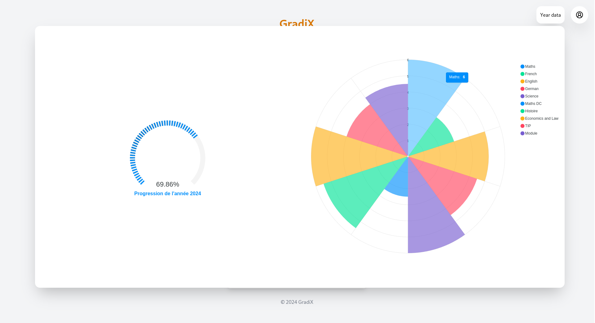
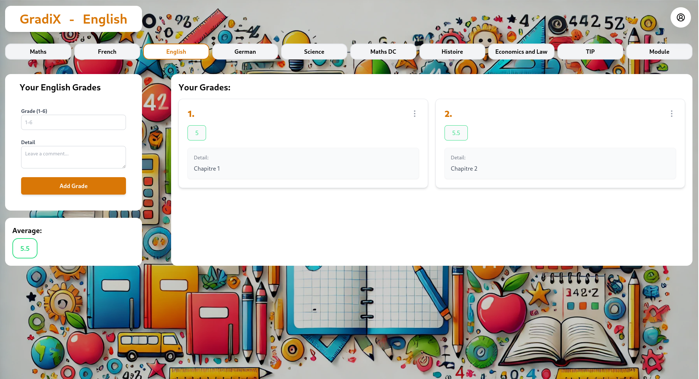

# GradiX <Badge type="tip" text="JS"/>

## Purpose

GradiX is an application I built for myself to follow my grades at school, see them per subject and
know what I still need in order to pass the year. It is split in two: a Django REST Framework
back-end holding the data and the rules, and a React front-end consuming it. I wrote both sides.

## Technologies

- Django
- Django REST Framework
- React
- Token authentication

## How it works

The back-end exposes the users, the subjects and the grades as REST resources. A user signs up or
logs in through dedicated actions on the user endpoint, which return a token that the front-end then
sends on every following request. Access is scoped on the server side: a viewset filters its queryset
down to the requesting user, so a user never receives another user's data even if they ask for it.
The React application reads those endpoints and turns them into the dashboard, the per subject pages
and the year summary.

```python
    # Here is an example of the UserViewSet in the views.py file, which is use to login and signup new user to the app

    class UserViewSet(viewsets.ModelViewSet):
        queryset = User.objects.all()
        serializer_class = UserSerializer
        permission_classes = [IsOwner]

        def get_queryset(self):
        return self.queryset.filter(id=self.request.user.id)

        # This action is used to login a user to the app by checking if the user exists and if the password is correct
        @action(detail=False, methods=['post'])
        def login(self, request):
        user = get_object_or_404(User, username=request.data['username'])
        if not user.check_password(request.data['password']):
        return Response({"detail": "Not found."}, status=status.HTTP_404_NOT_FOUND)
        token, created = Token.objects.get_or_create(user=user)
        serializer = UserSerializer(instance=user)
        return Response({"token": token.key, "user": serializer.data})

        # This action is used to signup a new user to the app by saving it to the database
        @action(detail=False, methods=['post'])
        def signup(self, request):
        serializer = UserSerializer(data=request.data)
        if serializer.is_valid():
        serializer.save()
        user = User.objects.get(username=request.data['username'])
        user.set_password(request.data['password'])
        user.save()
        token = Token.objects.create(user=user)
        return Response({"token": token.key, "user": serializer.data})
        return Response(serializer.errors, status=status.HTTP_400_BAD_REQUEST)
```

## Screens

The login:



The dashboard, with the subjects and the grades they hold:



The averages over the year:



A subject, where grades are added and removed:



## Operational Competencies Acquired

I designed how the information is structured before writing the screens: users owning subjects,
subjects holding grades, and the averages derived from them rather than stored, which is what lets
the year summary be recomputed from the grades alone. **(c1)**

I implemented both sides of the application: the Django REST Framework endpoints with their
serializers, their owner scoped queryset and their token based login, and the React front-end that
consumes them. **(g5)**

**Operational competencies:** c1, g5

## Source code

The repository is available [here](https://github.com/Alex-zReeZ/Grade_calculator_djangoReact).
