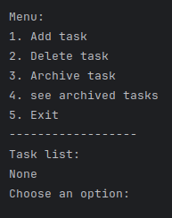

# Todo list <Badge type="tip" text="Py" />

## Purpose

A todo list running in the terminal, where tasks can be added, removed and marked as done. I wrote it
to get the basics of Python in place before using the language on a larger project.

## Technologies

- Python

## How it works

The tasks live in two lists, the active ones and the archived ones. A loop keeps asking the user what
they want to do and calls the matching function until they choose to quit, each operation being kept
in its own function rather than inline in the loop.

```python
# Here I created two lists to store the active and archived tasks
tasks = []
archived_tasks = []

# Here I created a function to add a task to the list of tasks
def add_task():
    new_task = input("Enter your new task: ")
    tasks.append(new_task)
    print("Task added successfully")
```

## Screens



## Operational Competencies Acquired

I implemented the program in Python, splitting it into functions for each operation on the task
lists.

## Source code

The repository is available [here](https://github.com/Alex-zReeZ/python-todolist).
