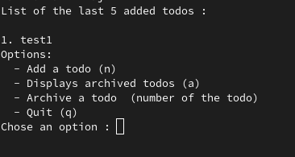

# Rust todo list <Badge type="tip" text="Rust" />

## Purpose

A todo list running in the command line, written to put into practice the Rust notions covered by the
IntelliJ exercises. I built it on my own, using the [Rust documentation](https://doc.rust-lang.org/book/)
as reference.

## Technologies

- Rust

## How it works

The todos are held in a structure that owns the list, and the display walks that list backwards so
the five most recent entries come out first, numbered from one for the reader rather than from the
index they occupy.

```rust

// This function, 'display_todos', prints the titles of the last 5 added todos.
fn display_todos(&self) {
    // Print a clear title for better readability.
    println!("List of the last 5 added todos:\n");

    // Iterate through the todos in reverse order, taking only the last 5.
    for (i, todo) in self.todos.iter().rev().take(5).enumerate() {
        // Print the index (1-based) and the todo title.
        println!("{}. {}", i + 1, todo);
    }
}

```

## Screens



## Operational Competencies Acquired

I implemented the program in Rust, including the storage of the todos in memory and the commands
that add and display them. **(g5)**

**Operational competencies:** g5

## Source code

The repository is available [here](https://github.com/Alex-zReeZ/todolist).
