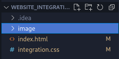

# Web integration <Badge type="tip" text="Html Css" />

## Purpose

This exercise consisted of rebuilding a web page from a mock-up that was handed to us as a PDF
export of a Figma design. The mock-up contained deliberate defects, misaligned text and boxes of
inconsistent sizes among others, so the work was not only to reproduce the page but also to correct
what was wrong in it.

## Technologies

- HTML
- CSS

## How it works

The page is a single HTML file with its stylesheet and a directory for the images. I worked directly
from the PDF, block by block, and fixed the alignment and sizing problems as I met them rather than
copying the defects into the result.

## Screens

The page to reproduce, captured from top to bottom:

The files it was built from:

## Operational Competencies Acquired

I turned a static prototype into a working page, judging where the prototype could not be followed
as drawn and correcting its alignment and sizing problems so the result stayed readable.

## Source code

The repository is available [here](https://github.com/Alex-zReeZ/Integration_web).
