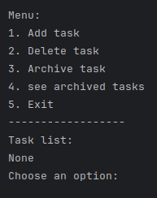

# Todo list <Badge type="tip" text="Py" />

## What is the project purpose ?

the purpose of this project was to create a todo list in python. The todo list is a simple list of tasks that you can 
add, remove and mark as done. This was to learn the basics of python and how to create a simple program with it for a future project.

## How it looks like



## How did I do it

As I said, it is a very simple program. I used the `input()` function to get the user input and a list to store the tasks.
Then I used a `while` loop to keep the program running until the user wants to quit.
All of that commended by functions to make the code more readable.

### Here is an exemple of my code

```python
# Here I created two lists to store the active and archived tasks
tasks = []
archived_tasks = []

# Here I created a function to add a task to the list of tasks
def add_task():
    new_task = input("Enter your new task: ")
    tasks.append(new_task)
    print("Task added successfully")
```

## You can find the [GitHub depot here](https://github.com/Alex-zReeZ/python-todolist)


