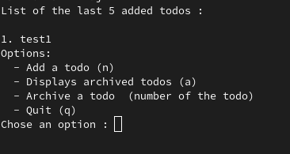

# Rust todo list <Badge type="tip" text="Rust" />

## What is the project purpose ?

This project was made to use the Rust knowledge that we acquire by doing the exercises proposed by Intellj.


For the realisation of this project, I use [Rust documentation](https://doc.rust-lang.org/book/).

## How it look like
\


## How did I do it

```rust 

// This function, 'display_todos', prints the titles of the last 5 added todos.
fn display_todos(&self) {
    // Print a clear title for better readability.
    println!("List of the last 5 added todos:\n");

    // Iterate through the todos in reverse order, taking only the last 5.
    for (i, todo) in self.todos.iter().rev().take(5).enumerate() {
        // Print the index (1-based) and the todo title.
        println!("{}. {}", i + 1, todo);
    }
}

```
Here is a snippet of my todo list code, this snippet is a function that when it is called,
show all the todos.


## How to initiate project

You simply need to creat a new Rust project

```shell
# Rust project creation 
cargo new folder_name --bin

# Execute program 
cargo run


```


## You can find the [GitHub depot here](https://github.com/Alex-zReeZ/todolist  )
