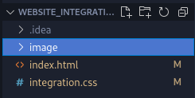

# Web integration <Badge type="tip" text="Html Css" />

## What is the project purpose ?

The purpose of this project was to recreate a website page from a figma mock-up converted to pdf,
to upgrade our Html and CSS knowledge.

## How it look like

## How did I do it

Created a simple directory with a html and CSS file with a picture directory. \
Then I just started to post the website from the pdf image we had.

## You can find the [GitHub depot here](https://github.com/Alex-zReeZ/Integration_web)
